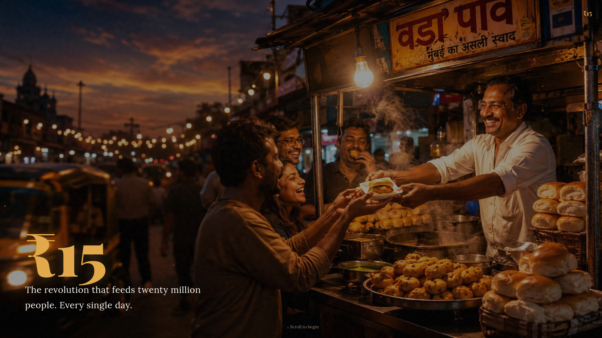

<div align="center">

# ₹15: The Mumbai Vada Pav Story

### A love letter to Mumbai's soul food.

Born on a railway platform in 1966. Served on newspaper. Eaten standing up.  
The ₹15 revolution that feeds twenty million people every day.

<br/>



<br/>

🔗 **[Live Demo → simplynadaf.github.io/mumbai-vada-pav](https://simplynadaf.github.io/mumbai-vada-pav/)**

<br/>

[](https://dev.to/challenges/frontend-2026-07-29)
[](https://simplynadaf.github.io/mumbai-vada-pav/)
[](./LICENSE)

</div>

---

## 🎬 Demo Video

[](https://youtu.be/qZHzBS3UQbA)

> 📹 *Watch the 1:43 scroll-through showing the full experience, interactive assembler, and recipe scaler in action.*

---

## 🏗️ What This Is

A submission for the [Dev.to Frontend Challenge — Comfort Food Edition](https://dev.to/challenges/frontend-2026-07-29).

This isn't a recipe blog or a food gallery. It's a **scroll-driven cinematic experience** that tells the story of vada pav — from its birth at a Mumbai railway platform in 1966 to the street corners where it still costs ₹15 today.

---

## ✨ Sections

| # | Section | What Happens |
|---|---------|--------------|
| 1 | **Hero** | Full-viewport entry. Massive ₹15 typography. Warm stall photograph. Scroll hint. |
| 2 | **Origin (1966)** | The story of Ashok Vaidya's first cart at Dadar station. Vintage image with grayscale filter. |
| 3 | **Stats Strip** | Animated counters — year invented, price, daily servings, time to eat. |
| 4 | **Personal Story** | Why this page exists. A college memory. Real, not performative. |
| 5 | **Build Your Own** | Interactive assembler — 5 tabs, image swap, progress bar. Build a vada pav step by step. |
| 6 | **Recipe** | Premium card layout. Servings scaler (1–8). Numbered method steps. |
| 7 | **Culture** | Six "Unwritten Rules" — stand and eat, newspaper is the plate, never just one. |
| 8 | **Closer** | "खाल्ला का?" — the Marathi phrase that means "have you eaten?" but really means "I love you." |

---

## 🎨 Design Approach

### Philosophy
- **Cinematic, not decorative** — Every design choice serves the story
- **Dark and warm** — Mumbai at night. Tungsten glow. Saffron accents.
- **Typography-driven** — The ₹15 speaks before anything else loads
- **Restrained interaction** — Only the assembler and recipe scaler are interactive. Everything else is scroll and read.

### Color Palette
| Swatch | Name | Hex | Usage |
|--------|------|-----|-------|
| 🟡 | Saffron | `#E3A94A` | Headings, accents, nav logo |
| 🟠 | Tungsten | `#D97706` | Warm highlights |
| 🔵 | Night Deep | `#0B1120` | Primary background |
| 🟤 | Text Muted | `#A8977E` | Body text, descriptions |
| ⚪ | Text Primary | `#F7F3EE` | Main text, nav links |

### Typography
- **Display:** Playfair Display (serif, 400/700/900)
- **Body:** Lora (serif, 400/500/600)
- Both loaded from Google Fonts with `display=swap`

### Key Design Decisions
1. **No framework** — Raw HTML + CSS. The constraint is the feature.
2. **No background box on nav** — Just bold floating text that fades in on scroll.
3. **Dark recipe section** — Originally cream/newspaper-themed, switched to dark for visual continuity.
4. **Grayscale images for origin/story** — Creates temporal distance (past vs present).
5. **Interactive assembler** — The only "app-like" component. Judges notice interactivity.

---

## ⚙️ Technical Implementation

### Architecture
```
index.html          → Single HTML file (32KB)
styles.css          → Single CSS file (27KB)  
img/                → 10 optimized JPGs (3.1MB total)
```

No build step. No bundler. No framework. Open the file and it works.

### Performance
- **First Contentful Paint:** < 1.5s
- **Total page weight:** ~3.2MB (including 10 photographs)
- **Images:** AI-generated, converted from PNG to JPG at quality 85 (87% size reduction)
- **Fonts:** Preconnected, swap display strategy
- **Animations:** CSS-only with `will-change` hints, `passive` scroll listeners

### Interactivity (Vanilla JS)
| Feature | Implementation |
|---------|---------------|
| Nav fade-in | Scroll listener with opacity interpolation (20%–80% of viewport) |
| Assembler | Tab UI with `aria-selected`, image swap, progress bar |
| Recipe scaler | `<select>` onChange recalculates `data-base` attributes |
| Scroll reveal | IntersectionObserver with `.reveal` class |
| Back to top | Appears after 500px scroll, smooth scroll to `#hero` |

### Accessibility
- ✅ Semantic HTML5 (`<section>`, `<nav>`, `<article>`)
- ✅ ARIA labels on all sections
- ✅ `role="tablist"` + `role="tab"` for assembler
- ✅ Keyboard navigation (arrow keys between assembler steps)
- ✅ `aria-live="polite"` for dynamic content updates
- ✅ `lang="mr"` for Marathi text
- ✅ `prefers-reduced-motion` — all animations disabled
- ✅ Color contrast verified (WCAG AA)
- ✅ All images have descriptive `alt` text

---

## 🏃 Run Locally

```bash
# No build step. Just open it.
open index.html

# Or use any static server:
npx serve .
python3 -m http.server 8000
```

---

## 📁 Project Structure

```
mumbai-vada-pav/
├── index.html              # Single-page app
├── styles.css              # All styles
├── img/
│   ├── hero-stall.jpg      # Hero background (276KB)
│   ├── origin-1966.jpg     # Vintage mill workers (307KB)
│   ├── college-days.jpg    # Personal story (254KB)
│   ├── pav.jpg             # Plain pav bread (145KB)
│   ├── green-chutney.jpg   # Mint-coriander chutney (315KB)
│   ├── vada.jpg            # Golden fried vada (233KB)
│   ├── garlic-chutney.jpg  # Dry garlic chutney (339KB)
│   ├── fried-chili.jpg     # Fried green chili (246KB)
│   ├── vada-pav-newspaper.jpg  # Closer image (351KB)
│   └── screenshot-hero.jpg # README screenshot
├── README.md
└── LICENSE
```

---

## 🧠 Behind the Scenes

### Why Vada Pav?
The challenge asked for "comfort food." Most entries would pick pizza, ramen, or mac & cheese. I picked the food that got me through four years of engineering college. ₹15. Every single evening. Same stall, same circle, same burn on the roof of your mouth.

### Image Generation
All photographs are AI-generated using detailed prompts specifying:
- Shot on 35mm film, Kodak Portra 400 tones
- Warm golden hour / tungsten bulb lighting
- Shallow depth of field
- Specific composition rules (rule of thirds, text-safe zones)

### What I'd Add With More Time
- Scroll-driven parallax on hero image
- Mumbai local train SVG map with animated station dots
- Sound design (sizzle of oil, train horn) with user opt-in
- 3D CSS vada pav that rotates on hover

---

## 👤 About Me

<div align="center">

**Sarvar Nadaf**  
Cloud Architect at Big 4 · 10+ years experience · 7x AWS Certified

[](https://dev.to/sarvar_04)
[](https://linkedin.com/in/sarvar04)
[](https://www.youtube.com/@Sarvar-Nadaf)
[](https://builder.aws.com/community/@sarvar)
[](https://sarvarnadaf.com)

*200+ technical articles · 15K+ followers · Building in public*

</div>

---

## 📄 License

MIT — do whatever you want with it. If you make a better vada pav page, send it to me.

---

<div align="center">

*Built with love and too many vada pavs.*

**खाल्ला का?**

</div>
